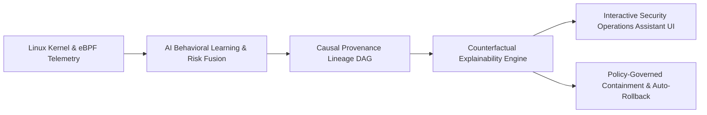

# ⚡ वज्र (Vajra) — AI-Powered Explainable Linux Security & Reliability Assistant

> **Team Name**: `Team_Red_Eagle`  
> **Track**: Integration of AI Capabilities in the OS Ecosystem (Linux Based)  
> **Problem Statement**: *AI-Powered Explainable Linux Security Assistant for Kernel-Level Intrusion & Behavioral Threat Detection*

---

## 🎯 Executive Overview

**वज्र (Vajra)** is a high-performance, explainable Linux runtime-security and proactive reliability platform. It captures kernel-level telemetry, learns workload-specific normal behavioral baselines using mathematical Markov models and entropy distributions, detects security intrusions and system pressure failures in real-time, synthesizes grounded counterfactual explanations, and executes policy-governed containment actions with automatic TTL rollbacks.



---

## 🧠 Key Capabilities & Technical Highlights

1. **Kernel-Level Telemetry & Dual-Runtime Mode**:
   - Live Linux eBPF probes for process lifecycle (`sched_process_exec`, `sched_process_exit`), network sockets (`connect`/`accept`), sensitive file access (`openat2`), and Linux Pressure Stall Information (PSI).
   - High-fidelity synthetic simulation engine for cross-platform evaluation and test replay without requiring root privileges.

2. **AI & Mathematical Behavioral Normality Learning**:
   - **Markov Process Ancestry Model**: Workload-specific transition probability graphs with Laplace smoothing ($-\log_2 P$) to prevent false-negative decay on repeat attacks.
   - **System Reliability Forecasting**: Linux PSI memory, CPU, and I/O pressure tracking via Exponential Weighted Moving Average (EWMA) and dynamic outlier scoring to predict Out-of-Memory (OOM) kills before they occur.
   - **Calibrated Bayesian Noisy-OR Fusion**: Additive fusion of deterministic rules, statistical novelty, resource failures, and TPM/IMA hardware attestation trust.

3. **Grounded Explainability & Minimal Counterfactuals**:
   - Solves $\arg\min \|\delta\|_0 \text{ s.t. } R < \theta_{\text{benign}}$ to explain the exact minimal factual changes that would make an anomalous verdict benign.
   - Reconstructs real-time causal execution DAGs (Process $\to$ Spawn $\to$ File $\to$ Socket).

4. **Policy-Governed Autonomous & Guided Remediation**:
   - Non-destructive cgroup v2 freezing (`cgroup.freeze`), localized network egress drops, and process termination with HMAC-SHA256 audit receipts.
   - Strict 30-minute Time-to-Live (TTL) auto-rollback to ensure zero unintentional system lockouts.

5. **Security Operations Assistant & Interactive Web Dashboard**:
   - Real-time threat feed, dynamic canvas DAG visualization, AI conversational assistant, and 1-click containment triggers.

---

## 📂 Repository Layout

```text
├── agent/                         # Privileged Linux telemetry sensor (Rust)
├── bpf/                           # CO-RE eBPF kernel C programs
├── contracts/                     # Unified event contracts (Protobuf)
├── policy/                        # Detection rules & response governance policies
│   ├── detection/                 # YAML detection rules (reverse shell, lotl, etc.)
│   └── response/                  # response_policy.yaml (action permissions & TTLs)
├── services/
│   ├── api/                       # FastAPI gateway & AI Security Assistant
│   ├── detector/                  # Anomaly detection, PSI forecaster & counterfactuals
│   ├── graph/                     # Causal provenance graph & Cytoscape exporter
│   └── responder/                 # Containment executor & rollback scheduler
├── test-lab/                      # Automated attack and reliability failure scenarios
│   ├── scenario_01_normal_web.py
│   ├── scenario_02_tmp_reverse_shell.py
│   ├── scenario_03_lotl_exfiltration.py
│   ├── scenario_04_memory_leak_oom.py
│   ├── scenario_05_attestation_failure.py
│   └── run_all_scenarios.py       # Master test runner
└── ui/                            # Interactive Web Assistant Dashboard
    ├── index.html
    ├── styles.css
    └── app.js
```

---

## 🚀 Quickstart & Local Execution

### 1. Run Automated Test Lab Scenarios
```bash
uv run --directory services/detector python ../../test-lab/run_all_scenarios.py
```

### 2. Run Test Suites
```bash
# Detector Unit Tests (5/5)
uv run --directory services/detector pytest

# API & Assistant Tests (5/5)
uv run --directory services/api pytest
```

### 3. Launch Interactive Security Assistant Web Dashboard
```bash
uv run --directory services/api uvicorn app.main:app --reload --port 8000
```
Open **`http://localhost:8000`** in your browser to interact with the **Vajra (वज्र)** Security Assistant dashboard, trigger live scenarios, view causal provenance graphs, and chat with the AI assistant.

---

## 🛡️ Team Red Eagle
Developed with pride for the **CDAC Hackathon**.
