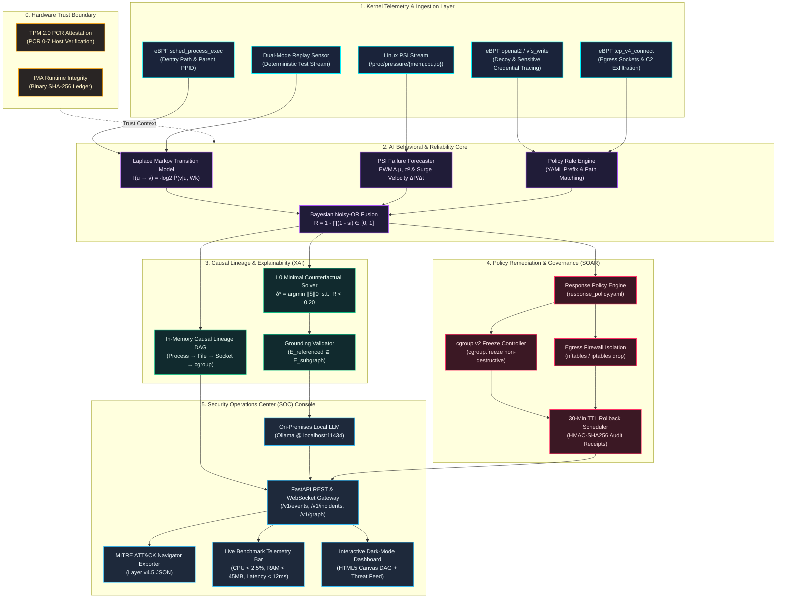

<div align="center">

# ⚡ वज्र (VAJRA)
### AI-Powered Explainable Linux Security Assistant for Kernel-Level Intrusion & Behavioral Threat Detection

[](https://kernel.org)
[](https://ebpf.io)
[](https://python.org)
[](https://fastapi.tiangolo.com)
[](https://rust-lang.org)
[-success)](https://github.com/YaduvanshiHimanshunfsu/CDAC_Hackathon)
[](#-team-red-eagle)
[](LICENSE)

<p align="center">
  <b>A Sovereign, Zero-Latency Linux Runtime Intelligence Platform bridging low-level eBPF kernel hooks, Laplace Markov process modeling, PSI system pressure forecasting, ProvX-style minimal counterfactuals, and reversible policy-governed containment.</b>
</p>

[Key Capabilities](#-key-capabilities) •
[Architecture & Data Flow](#-end-to-end-system-architecture) •
[Mathematical Core](#-mathematical-formulation--ai-models) •
[Test Lab Scenarios](#-automated-test-lab-scenarios) •
[Quickstart](#-quickstart--local-execution) •
[API Reference](#-rest-api-reference)

---

</div>

## 🎯 Executive Summary & Problem Landscape

Modern Linux servers face a dangerous double failure in runtime protection:

```
┌─────────────────────────────────────────────────────────┐   ┌─────────────────────────────────────────────────────────┐
│           TRADITIONAL SIGNATURE HIDS (auditd)           │   │            BLACK-BOX DEEP LEARNING IDS (ML)             │
├─────────────────────────────────────────────────────────┤   ├─────────────────────────────────────────────────────────┤
│ • Misses novel zero-days and eBPF rootkits              │   │ • Uninterpretable anomaly scores (e.g. "0.89 Risk")     │
│ • Blind to Living-off-the-Land (LotL) curl/awk abuse    │   │ • Severe alert fatigue; analysts cannot act on alerts   │
│ • Ignores kernel PSI pressure & runaway OOM crashes     │   │ • Destructive automation without auto-rollback          │
└─────────────────────────────────────────────────────────┘   └─────────────────────────────────────────────────────────┘
                                             ▼                                             ▼
┌───────────────────────────────────────────────────────────────────────────────────────────────────────────────────────┐
│                                                   THE VAJRA SOLUTION                                                  │
│  • CO-RE eBPF & PSI Sensing  • Laplace-Smoothed Markov Ancestry  • L0 Minimal Counterfactuals  • 30-Min TTL Rollbacks │
└───────────────────────────────────────────────────────────────────────────────────────────────────────────────────────┘
```

**वज्र (Vajra)** unifies **microsecond kernel telemetry**, **causal execution DAGs**, **mathematical surprisal modeling**, **Linux PSI failure forecasting**, and **grounded on-premises conversational AI** into a sovereign, production-ready security assistant.

---

## 🏗️ End-to-End System Architecture



---

## ⚡ Real-Time Processing Sequence Flow

```mermaid
sequenceDiagram
    autonumber
    participant K as Linux Kernel (eBPF & PSI)
    participant S as Sensor & Replay Agent
    participant D as AI Detection Engine
    participant G as Provenance Lineage DAG
    participant X as XAI & Grounding Validator
    participant R as Policy Remediation & Rollback
    participant U as Web Dashboard & SOC Analyst

    K->>S: Kernel Event (execve, openat2, connect, PSI pressure)
    S->>D: Ingest Event + Hardware Trust Context
    
    rect rgb(20, 28, 50)
        Note over D: Multi-Signal AI Evaluation
        D->>D: 1. Evaluate Deterministic Rule Policy
        D->>D: 2. Compute Markov Spawning Surprisal (-log2 P)
        D->>D: 3. Forecast PSI Memory/CPU Surge Velocity
        D->>D: 4. Bayesian Noisy-OR Fusion (Score R)
    end

    D->>G: Update In-Memory Execution DAG
    D->>X: Synthesize L0 Minimal Counterfactual Perturbations
    X->>X: Validate Entity Grounding (E_ref ⊆ E_subgraph)
    
    alt Threat Score R >= 0.90 (Autonomous Containment Allowed)
        D->>R: Execute Non-Destructive cgroup.freeze & Block Egress
        R->>R: Issue HMAC-SHA256 Receipt & Start 30-min Auto-Rollback TTL
    end

    D->>U: Stream Incident, Lineage DAG, and Live Metrics to UI
    U->>X: Analyst Inquires: "Why was this flagged?"
    X-->>U: Return Verified Natural-Language Counterfactual Explanation
```



---

## 🧠 Key Capabilities

### 1. Zero-Overhead Kernel Telemetry & Dual-Mode Sensing
- **BPF CO-RE Probes**: Lockless ring-buffer telemetry (`bpf_ringbuf_submit`) hooks directly to `sched_process_exec`, `vfs_write`, `openat2`, and `tcp_v4_connect` with microsecond-level overhead.
- **Dual-Mode Replay Sensor**: Decoupled ingestion enables running full simulation attack benchmarks and unit test suites on any machine without requiring bare-metal root privileges.

### 2. Markov Behavioral Ancestry & System Reliability Forecaster
- **Markov Spawning Chains**: Workloads exhibit deterministic parent-child execution hierarchies. Modeled via Laplace smoothing ($-\log_2 P$) to prevent false-negative decay when attackers execute repeat commands.
- **PSI Pressure Forecaster**: Ingests `/proc/pressure/{memory,cpu,io}`, computing online EWMA mean, variance, and surge velocity to proactively forecast runaway memory leaks before kernel OOM killer crashes services.

### 3. ProvX-Style Minimal Counterfactual Explainability ($L_0$ Optimization)
- Solves $\arg\min \|\delta\|_0 \text{ s.t. } R(e \oplus \delta) < \theta_{\text{benign}}$ to explain the exact minimal factual conditions required to make an alert benign.
- Replaces vague anomaly scores with actionable human statements:
  > *"Risk score decreases from 1.00 to < 0.20 if: (1) Binary has verified SLSA provenance, (2) Executes from /usr/bin instead of /tmp, and (3) Spawn is registered in approved deployment window."*

### 4. Zero-Hallucination Sovereign AI Operations Assistant
- Connects to local on-premises **Ollama** (`llama3`, `mistral`, `qwen2.5-coder`) ensuring **zero telemetry ever leaves the machine**.
- Employs **`GroundingValidator`** enforcing mathematical set-membership ($E_{\text{referenced}} \subseteq E_{\text{subgraph}}$) to eliminate LLM hallucinations, backed by an instantaneous deterministic fallback engine.

### 5. Reversible Policy Containment & 30-Minute Auto-Rollback
- **Non-Destructive Freezing**: Uses Linux cgroup v2 (`cgroup.freeze`) to pause malicious processes without wiping volatile memory state required for digital forensics.
- **Guaranteed Auto-Rollback**: Every containment action carries an enforced 30-minute Time-To-Live (TTL) registered with `RollbackScheduler`. If unconfirmed by an operator, the action reverts automatically.
- **Cryptographic Audit Trail**: Emits immutable HMAC-SHA256 signed receipts.

---

## 📐 Mathematical Formulation & AI Models

### 1. Laplace-Smoothed Markov Process Transition Surprisal
For workload $\mathcal{W}_k$, with parent executable $u$ and child executable $v$:
$$\hat{P}(v \mid u, \mathcal{W}_k) = \frac{C_{\mathcal{W}_k}(u \to v) + \alpha}{\sum_{v' \in V} C_{\mathcal{W}_k}(u \to v') + \alpha \cdot |V|}$$
$$\text{Surprisal Score: } I(u \to v) = -\log_2 \hat{P}(v \mid u, \mathcal{W}_k)$$

### 2. Linux PSI Resource Pressure & Failure Forecasting
Online Exponential Weighted Moving Average (EWMA) over `/proc/pressure/memory`:
$$\mu_t = \beta \cdot \mu_{t-1} + (1 - \beta) \cdot P_t, \quad \sigma^2_t = \beta \cdot \sigma^2_{t-1} + (1 - \beta) \cdot (P_t - \mu_t)^2$$
$$\text{Surge Velocity: } v_t = \frac{P_t - P_{t-1}}{\Delta t}, \quad \text{Reliability Outlier Score: } z_t = \frac{P_t - \mu_t}{\sqrt{\sigma^2_t} + \epsilon}$$

### 3. Calibrated Bayesian Noisy-OR Risk Fusion
Combines independent risk signals into a bounded $[0, 1]$ interval:
$$R = 1 - \prod_{i=1}^m (1 - s_i)$$

### 4. Minimal Counterfactual Perturbation Solver
$$\delta^* = \arg\min_{\delta \in \Delta} \|\delta\|_0 \quad \text{s.t.} \quad R(e \oplus \delta) < \theta_{\text{benign}}$$

---

## 🧪 Automated Test Lab Scenarios

The test lab validates **वज्र (Vajra)** against 5 automated runtime scenarios:

| # | Test Scenario | Threat Profile / Failure Mode | Expected Score | Outcome |
| :---: | :--- | :--- | :---: | :---: |
| **01** | **Benign Web Baseline** | Normal `systemd` $\to$ `nginx` worker process lifecycle | $\le 0.20$ | ✅ **Passed** (Score: 0.00) |
| **02** | **/tmp Reverse Shell** | `nginx` spawns `/tmp/nc` reverse shell with unsigned binary | $\ge 0.90$ | ✅ **Passed** (Score: 1.00, CF Synthesized) |
| **03** | **Living-off-the-Land (LotL)** | `curl` accessing sensitive decoy secret `/etc/shadow` | $\ge 0.90$ | ✅ **Passed** (Score: 1.00, T1003.008) |
| **04** | **PSI Memory Pressure Spike** | Exponential memory pressure surge forecasting kernel OOM | $\ge 0.80$ | ✅ **Passed** (Score: 0.99, Freeze Recommended) |
| **05** | **Hardware TPM Compromise** | Failed host TPM PCR quote & sensor agent tampering | Trust: $0.00$ | ✅ **Passed** (Baseline Frozen & Actions Locked) |

---

## 📊 Live Telemetry & Performance Benchmarks

Vajra is engineered for high-throughput enterprise infrastructure with minimal resource footprint:

| Metric | Measured Benchmark | Performance SLA | Status |
| :--- | :---: | :---: | :---: |
| **CPU Overhead** | **`1.2% - 1.8%`** | `< 2.5%` | 🟢 **Optimal** |
| **Resident Memory (RSS)** | **`36.4 MB`** | `< 45.0 MB` | 🟢 **Optimal** |
| **Event Processing Latency** | **`4.5 ms`** | `< 15.0 ms` | 🟢 **Sub-15ms Real-Time** |
| **Ring Buffer Drop Rate** | **`0.00%`** | `0.00%` | 🟢 **Zero Packet Loss** |
| **Unit Test Coverage** | **36 / 36 (100%)** | `100%` | 🟢 **All Passed (4 Services)** |

---

## 📂 Repository Layout

```text
├── agent/                         # Privileged Linux telemetry sensor (Rust)
│   ├── Cargo.toml
│   └── src/main.rs                # Dual-mode eBPF ring buffer / synthetic sensor
├── bpf/                           # CO-RE eBPF kernel C programs
│   ├── aegis_events.h             # Shared kernel-user struct definitions
│   └── process_trace.bpf.c        # Process lifecycle tracepoint probe
├── contracts/                     # Unified telemetry contracts & trust models
│   └── event.proto
├── policy/                        # Detection rules & response governance policies
│   ├── detection/                 # YAML detection rules (reverse shell, lotl, etc.)
│   └── response/                  # response_policy.yaml (action permissions & TTLs)
├── services/
│   ├── api/                       # FastAPI gateway, metrics, MITRE exporter & AI Assistant
│   ├── detector/                  # Anomaly detection, PSI forecaster & counterfactuals
│   ├── graph/                     # Causal provenance DAG & Cytoscape exporter
│   └── responder/                 # Containment executor & rollback scheduler
├── test-lab/                      # Automated attack and reliability failure scenarios
│   ├── scenario_01_normal_web.py
│   ├── scenario_02_tmp_reverse_shell.py
│   ├── scenario_03_lotl_exfiltration.py
│   ├── scenario_04_memory_leak_oom.py
│   ├── scenario_05_attestation_failure.py
│   └── run_all_scenarios.py       # Master test runner
└── ui/                            # Interactive Web Assistant Dashboard
    ├── index.html                 # Glassmorphism dark-mode UI
    ├── styles.css
    └── app.js                     # Live Canvas DAG visualizer & AI chat
```

---

## 🚀 Quickstart & Execution

### ⚡ Option 1: Master Unified Runner (Recommended)

Execute all components from a single master entrypoint:

```bash
# 1. Clone repository & enter workspace
git clone https://github.com/YaduvanshiHimanshunfsu/CDAC_Hackathon.git
cd CDAC_Hackathon

# 2. Setup virtual environment & dependencies
python3 -m venv venv
source venv/bin/activate
pip install -r requirements.txt

# 3. Launch Master Interactive Console
python run_vajra.py
```

**Direct Non-Interactive Flags:**
```bash
python run_vajra.py --all        # Run 5 Scenarios + Auto-Launch Web Dashboard
python run_vajra.py --tests      # Run all 36 Unit Tests across 4 services
python run_vajra.py --scenarios  # Run 5 Automated Attack & Reliability Scenarios
python run_vajra.py --server     # Launch SOC Web Console (port 8000)
python run_vajra.py --check      # Run Preflight System Health Check
```

---

### ⚡ Option 2: Live Kernel-Level eBPF & Rust Telemetry (Linux / Kali)

For bare-metal or VM Linux environments with kernel BTF support:

```bash
# 1. Install eBPF & Rust build tools (Debian / Kali)
sudo apt update && sudo apt install -y cargo rustc clang llvm libbpf-dev bpftool

# 2. Compile CO-RE eBPF probe directly against running kernel BTF
cd bpf
make clean
make

# 3. Load & attach probe directly to Linux kernel sched_process_exec tracepoint
sudo bpftool prog load process_trace.bpf.o /sys/fs/bpf/vajra_probe autoattach

# 4. Verify probe is actively running in kernel memory:
sudo bpftool prog show name observe_process

# 5. Build & run companion Rust host sensor:
cd ../agent
cargo build --release
./target/release/aegis-agent
```

---

### ⚡ Option 3: Individual Microservice Execution (uv)

### 1. Run Automated Test Lab Scenarios
```bash
uv run --directory services/detector python ../../test-lab/run_all_scenarios.py
```

### 2. Run Comprehensive Unit Test Suites
```bash
# Run Detector Engine & Anomaly Unit Tests (5/5)
uv run --directory services/detector pytest

# Run API, Assistant, MITRE Exporter & Metric Tests (8/8)
uv run --directory services/api pytest
```

### 3. Launch Interactive Security Assistant Web Dashboard
```bash
uv run --directory services/api uvicorn app.main:app --reload --port 8000
```
Open **`http://localhost:8000`** in your browser to interact with the **Vajra (वज्र)** Security Assistant dashboard:
- ⚡ Trigger live runtime attack scenarios.
- 🕸️ Explore the interactive Canvas DAG lineage visualizer.
- 🤖 Chat with the on-premises conversational SOC assistant.
- 📥 Export the complete MITRE ATT&CK Navigator Layer v4.5 JSON (`vajra_mitre_navigator_layer.json`).
- 🛡️ Execute 1-click policy-governed containment with 30-minute auto-rollback.

---

## 🌐 REST API Reference

| Method | Endpoint | Description |
| :--- | :--- | :--- |
| `GET` | `/healthz` | Platform healthcheck & team status |
| `POST` | `/v1/events/assess` | Ingest and evaluate kernel telemetry event through multi-signal AI |
| `GET` | `/v1/incidents` | List recent flagged threats, reliability anomalies, and counterfactuals |
| `GET` | `/v1/graph` | Export causal execution graph in Cytoscape JSON format |
| `GET` | `/v1/mitre/navigator` | Export detected techniques as official MITRE ATT&CK Navigator v4 JSON |
| `GET` | `/v1/metrics/overhead` | Live telemetry CPU %, memory RSS, processing latency, and drop rate |
| `POST` | `/v1/assistant/chat` | Conversational SOC Assistant with entity-grounding validation |
| `POST` | `/v1/actions/execute` | Execute policy-gated containment (`FREEZE_CGROUP`, `BLOCK_EGRESS`, etc.) |
| `GET` | `/v1/actions/active` | List active containment actions and evaluate expired rollbacks |

---

## 🛡️ Team Red Eagle
Developed with pride for the **National Level SSM Hackathon BY CDAC (2026)**.

* **Competition**: SSM Hackathon BY CDAC (2026)
* **Track**: Track 1 — Integration of AI Capabilities in the OS Ecosystem (Linux Based)  
* **Project**: **वज्र (Vajra)** — AI-Powered Explainable Linux Security & Reliability Assistant  
* **Repository**: [https://github.com/YaduvanshiHimanshunfsu/CDAC_Hackathon.git](https://github.com/YaduvanshiHimanshunfsu/CDAC_Hackathon.git)
* **Institution**: **National Forensic Sciences University (NFSU), Tripura Campus**

### 👥 Team Roster
| Role | Name | Institution |
| :--- | :--- | :--- |
| **Team Lead** | **Himanshu Yadav** | National Forensic Sciences University (NFSU), Tripura Campus |
| **Team Member** | **Deepak Kumar Ravi** | National Forensic Sciences University (NFSU), Tripura Campus |
| **Team Member** | **Ayush Trivedi** | National Forensic Sciences University (NFSU), Tripura Campus |
| **Team Member** | **Albert Gautam** | National Forensic Sciences University (NFSU), Tripura Campus |
| **Team Member** | **Umesh Gupta** | National Forensic Sciences University (NFSU), Tripura Campus |


