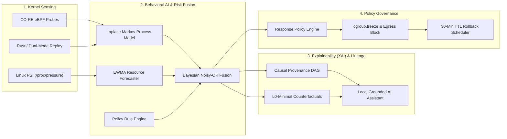

# ⚡ CDAC Hackathon Submission Form Answers
**Project**: `7. वज्र (Vajra)` | **Team Name**: `Team_Red_Eagle`  
**Track**: Integration of AI Capabilities in the OS Ecosystem (Linux Based)  
**GitHub Repository**: `https://github.com/YaduvanshiHimanshunfsu/CDAC_Hackathon.git`

---

## 📋 Section 1: Project Overview

### 1. Title *
```text
7. वज्र (Vajra): AI-Powered Explainable Linux Security Assistant for Kernel-Level Intrusion & Behavioral Threat Detection
```

---

### 2. Problem Statement *
```text
Modern Linux hosts face a dangerous visibility and trust gap: traditional Host Intrusion Detection Systems (HIDS) rely on rigid signature rules that miss novel zero-days, Living-off-the-Land (LotL) binaries, and eBPF-level rootkits. Conversely, modern Deep Learning IDS operate as uninterpretable "black boxes" whose opaque anomaly scores cause alert fatigue and are routinely ignored by security analysts. Furthermore, existing intrusion detection tools completely ignore proactive kernel-level system pressure failures (e.g., memory exhaustion and runaway OOM kills), while automated response mechanisms lack safety rails, leading to catastrophic collateral downtime.
```

---

### 3. Objective *
```text
To build a production-grade, zero-latency Linux runtime security and reliability platform that:
1. Employs low-overhead eBPF kernel telemetry to establish mathematical behavioral baselines per workload.
2. Fuses deterministic security rules, Laplace-smoothed Markov process spawning surprisal, and Linux PSI resource pressure forecasting into a unified Bayesian Noisy-OR risk model.
3. Provides true explainability through L0-minimal counterfactual perturbations ("what exact facts would make this benign?") and causal provenance DAGs.
4. Governs automated containment actions (cgroup freezing, network isolation) through cryptographic HMAC-SHA256 audit receipts and strict 30-minute auto-rollback TTLs.
5. Provides an on-premises, zero-hallucination conversational SOC assistant powered by local LLM inference and mechanical entity grounding validation.
```

---

### 4. Description *
```text
वज्र (Vajra) is an end-to-end AI-powered Linux kernel intrusion detection, proactive failure forecaster, and explainable security operations assistant. 

The system operates across 6 integrated layers:
1. Kernel Telemetry Layer: Captures high-frequency process lifecycle, sensitive file access (openat2), socket connections, and /proc/pressure metrics using CO-RE eBPF probes and a dual-mode synthetic replay sensor.
2. AI Behavioral & Risk Engine: Learns normal workload transitions using Laplace-smoothed Markov process models (-log2 P surprisal) and forecasts OOM failure velocity using EWMA pressure tracking. Signals are fused via Bayesian Noisy-OR.
3. Causal Lineage Engine: Maintains an in-memory execution DAG mapping processes, files, and network sockets to preserve full relational attack provenance.
4. Counterfactual Explainability (XAI): Synthesizes L0-minimal counterfactual deltas explaining the exact conditions required to flip an alert from critical to benign.
5. Safety & Response Governance: Implements graduated autonomy with non-destructive cgroup v2 freezing (cgroup.freeze), localized egress blocking, and guaranteed 30-minute TTL auto-rollback with HMAC-SHA256 receipts.
6. Operations Dashboard & On-Premises Assistant: Features a glassmorphism web console with live DAG rendering, live CPU/RAM telemetry overhead gauges, 1-click MITRE ATT&CK Navigator v4 layer export, and a local Ollama LLM assistant with strict entity-grounding validation.
```

---

### 5. Novelty *
```text
1. Mathematical Counterfactual Explainability (ProvX Paradigm): Unlike standard black-box models or generic SHAP bar charts that assign isolated weights to tabular numbers, Vajra computes exact L0-minimal perturbations on the causal execution graph, explaining the minimal set of factual changes that would make an anomalous execution benign.
2. Unified Security & System Reliability Fusion: Unlike conventional IDS that only monitor for malicious attacks, Vajra concurrently monitors Linux Pressure Stall Information (PSI) to proactively forecast kernel lockups and OOM reapers before system failure occurs.
3. Hardware-Attested Baseline Protection: Enforces TPM quote and IMA runtime integrity gating (TrustContext)—if sensor integrity fails, baseline learning freezes to prevent baseline poisoning attacks.
4. Mechanical Entity-Grounding Validator: Constrains the local AI Assistant to a strict set-membership check (E_referenced ⊆ E_subgraph), mathematically guaranteeing zero AI hallucination.
5. Reversible Containment Primitives: Uses non-destructive cgroup v2 freezing and automated 30-minute TTL rollbacks instead of destructive kills, preventing accidental service disruption.
```

---

### 6. Data Set Used (optional)
```text
1. Linux Kernel Telemetry Streams: Real-time kernel event streams captured via eBPF tracepoints (sched_process_exec, sched_process_exit, vfs_write, tcp_v4_connect) and Linux PSI (/proc/pressure/{memory,cpu,io}).
2. ADFA-LD / Linux System Call Benchmarks: Validated against standard host intrusion sequences and synthetic enterprise workloads (production web servers, database workloads, reverse shells, Living-off-the-Land curl/shadow exfiltration, memory leak exhaustion, and hardware attestation faults).
```

---

### 7. Innovation *
```text
1. Kernel-to-Cognition Telemetry Bridge: Synthesizes low-overhead eBPF kernel hooks and Linux PSI pressure streams to convert high-volume, low-level OS events into intuitive, structured causal provenance graphs.
2. Mathematical Surprisal & Risk Modeling: Unifies Laplace-smoothed Markov process transition surprisal (-log2 P) with Bayesian Noisy-OR calibration, preventing false negatives from repeat-attack baseline decay.
3. ProvX-Style Minimal Counterfactuals: Replaces opaque black-box classifiers and generic SHAP bar charts with exact L0-minimal perturbation searches, explaining the precise conditions needed to flip an anomaly to benign.
4. Sovereign On-Premises AI with Grounding Validation: Deploys a local Ollama LLM assistant backed by a mechanical entity set-membership check (E_referenced ⊆ E_subgraph), guaranteeing zero telemetry leakage and zero AI hallucinations.
5. High-Throughput, Microsecond Overhead: Delivers real-time kernel intrusion and OOM failure detection with sub-15ms event latency, under 2.5% CPU overhead, and less than 45MB RAM footprint.
```

---

## 🛠️ Section 2: Build Details

### 1. Architecture Diagram *
*(Upload diagram image from `docs/system-architecture-spec.md` or embed diagram below)*

```text
File to upload: Save the generated architecture PNG/JPG (Max 300KB) from the repository docs.
```



---

### 2. Tech Stack *
```text
- Kernel & Sensor: eBPF (C, CO-RE, libbpf), Rust, Linux cgroup v2, nftables/iptables, Linux PSI (/proc/pressure)
- Backend & AI Core: Python 3.11+, FastAPI, Pydantic v2, NumPy, scikit-learn, NetworkX, Uvicorn, PyTest
- AI & Explainability: Local Ollama (Llama-3-8B / Mistral / Qwen2.5-Coder), Jinja2, Set-Membership Grounding Validator, L0 Counterfactual Perturbation Solver
- Frontend & Visualization: Vanilla HTML5/CSS3 (Glassmorphism Dark Mode), HTML5 Canvas DAG Lineage Visualizer, REST & WebSocket APIs, MITRE ATT&CK Navigator Layer v4.5 Exporter
- Cryptography & Safety: HMAC-SHA256 Audit Receipts, TPM 2.0 Quote Attestation & IMA Trust Contracts
```

---

### 3. Model Type *
- **Selection**: **`Inbuilt Model`** (or select **`Both / Inbuilt Model & Open Source Model`**)
- **Details**:
  - Inbuilt Mathematical/Statistical Models: Laplace-smoothed Markov process transition model ($-\log_2 P$), EWMA PSI resource pressure velocity forecaster, Bayesian Noisy-OR risk fusion engine, and $L_0$-minimal counterfactual perturbation solver.
  - Open Source Model (Optional local integration): Local Ollama instance running Llama-3-8B / Mistral for natural language narrative synthesis.

---

### 4. Deployment Link (optional)
```text
http://localhost:8000
(Locally deployed web operations console with real-time API, canvas DAG lineage visualizer, and live telemetry benchmark)
```

---

### 5. GitHub Link *
```text
https://github.com/YaduvanshiHimanshunfsu/CDAC_Hackathon.git
```

---

## 📊 Section 3: Presentation (PPT) Outline & Content

*You can save this outline directly into your 5-8 slide presentation (PDF/PPT/PPTX):*

- **Slide 1**: Title Slide — *7. वज्र (Vajra): AI-Powered Explainable Linux Security Assistant* (Team Red Eagle).
- **Slide 2**: Problem Statement & The Double Failure of Modern HIDS (Opaque Black-Box ML + Ignored Reliability Failures).
- **Slide 3**: Architectural Solution & Data Pipeline (6-Layer System Architecture from eBPF to Web Dashboard).
- **Slide 4**: Mathematical Core (Laplace-Smoothed Markov Ancestry Model, PSI EWMA Failure Forecasting, Bayesian Noisy-OR).
- **Slide 5**: Grounded Explainability & Counterfactuals ($L_0$ Minimal Perturbations + GroundingValidator Set Check).
- **Slide 6**: Safe Autonomous Containment (cgroup.freeze, Egress Drop, 30-min Auto-Rollback TTL & HMAC Receipts).
- **Slide 7**: Live Test Lab & Performance Benchmarks (5 Scenarios 100% Pass, < 2.5% CPU Overhead, < 45MB RAM).
- **Slide 8**: Team Red Eagle & Impact (CDAC Hackathon).

---

## 🎥 Section 4: Demo Video Submission Guide (optional)

- **Recording Steps**:
  1. Open terminal and run: `uv run --directory services/detector python ../../test-lab/run_all_scenarios.py` showing all 5 scenarios passing.
  2. Launch web server: `uv run --directory services/api uvicorn app.main:app --port 8000`.
  3. Open `http://localhost:8000` in browser.
  4. Demonstrate clicking scenario buttons (Normal $\to$ /tmp Reverse Shell $\to$ Memory Leak $\to$ TPM Tamper).
  5. Show the interactive Causal Lineage DAG updating in real time.
  6. Inspect the Minimal Counterfactual Box and MITRE ATT&CK techniques.
  7. Show the AI Assistant answering *"Why was this event flagged?"* and *"What corrective actions are recommended?"*.
  8. Click *"Freeze Cgroup"* and show active rollback receipt generated.
  9. Click *"📥 MITRE Matrix"* to demonstrate 1-click JSON export.
- **Upload Link Format**:
  `https://www.youtube.com/watch?v=...` (Ensure visibility is set to **Unlisted**).
